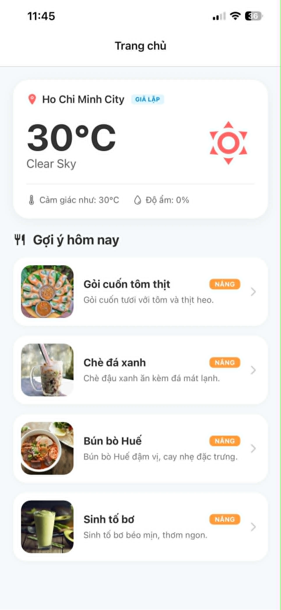
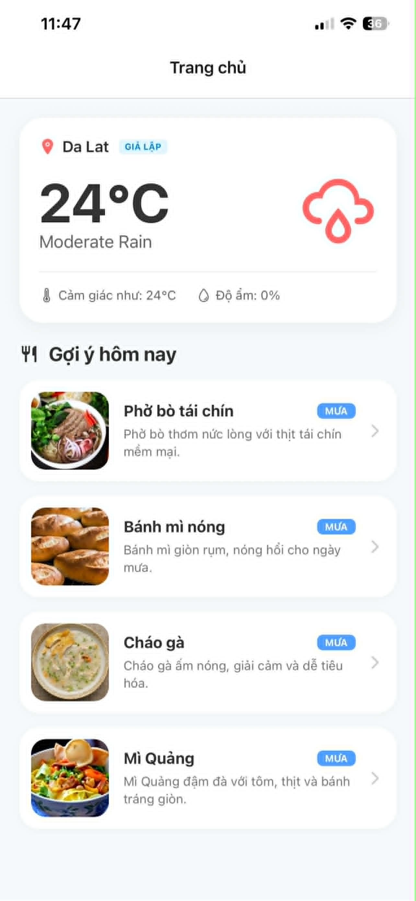
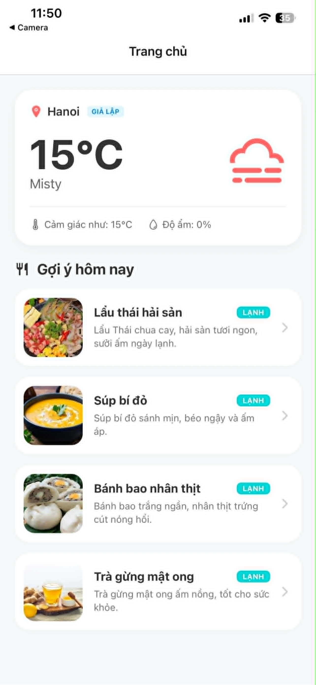
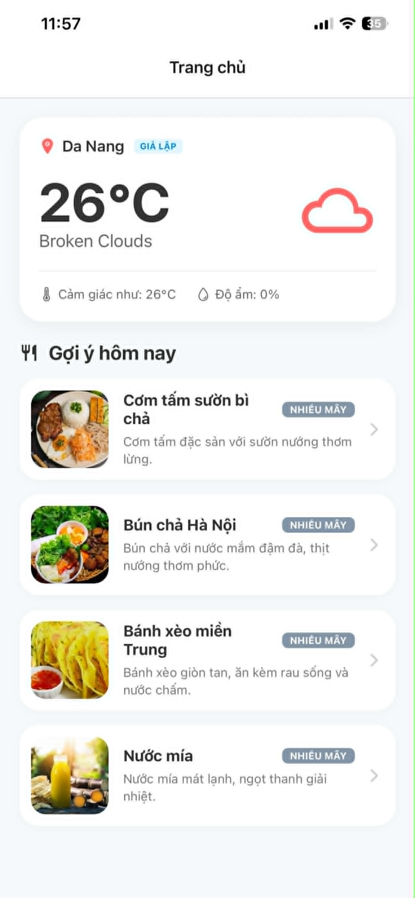
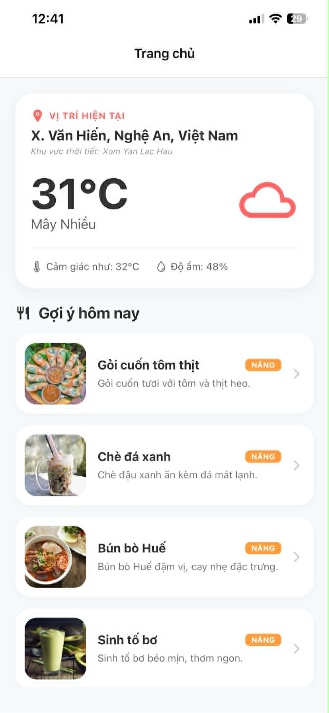
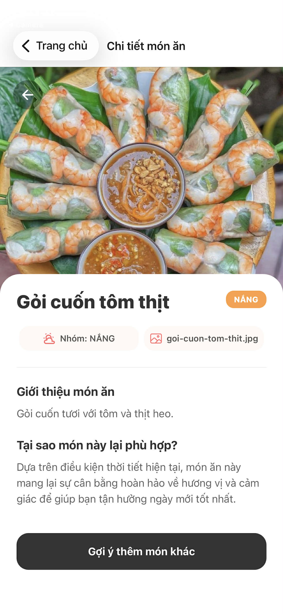

# WeatherFood - Gợi ý món ăn theo thời tiết 🌦️🍲

<div align="center">
  
  
  
  <br/>
  
  
  
  <br/>
  
  
</div>

---

## 🌟 Giới thiệu
**WeatherFood** là một ứng dụng di động hiện đại được xây dựng trên nền tảng **React Native** và **Expo**. Ứng dụng giúp người dùng xóa tan nỗi lo "Hôm nay ăn gì?" bằng cách đưa ra các gợi ý món ăn phù hợp nhất dựa trên điều kiện thời tiết thực tế tại vị trí hiện tại.

Sức mạnh của ứng dụng nằm ở sự kết hợp giữa:
- 📍 **GPS & Reverse Geocoding**: Xác định vị trí và địa chỉ chính xác đến từng con phố.
- ☁️ **Weather Intelligence**: Phân tích dữ liệu thời tiết thực tế qua OpenWeatherMap API.
- 🥘 **Gastronomy Logic**: Hệ thống gợi ý 16 món ăn đặc trưng được phân loại khoa học theo cảm xúc và điều kiện môi trường.

---

## 📸 Hình ảnh ứng dụng (Screenshots)

<div align="center">
  <table>
    <tr>
      <td align="center"><b>Trời Nắng (Sunny)</b></td>
      <td align="center"><b>Trời Mưa (Rainy)</b></td>
      <td align="center"><b>Trời Lạnh (Cold)</b></td>
    </tr>
    <tr>
      <td></td>
      <td></td>
      <td></td>
    </tr>
    <tr>
      <td align="center"><b>Nhiều Mây (Cloudy)</b></td>
      <td align="center"><b>Dữ Liệu Thật (Real API)</b></td>
      <td align="center"><b>Chi Tiết Món Ăn</b></td>
    </tr>
    <tr>
      <td></td>
      <td></td>
      <td></td>
    </tr>
  </table>
</div>

---

## 🚀 Tính năng nổi bật

- [x] 📍 **Định vị chính xác**: Tự động lấy tọa độ GPS và chuyển đổi sang địa chỉ tiếng Việt (Phường/Quận/Thành phố).
- [x] ☁️ **Dữ liệu thời gian thực**: Kết nối trực tiếp với trạm khí tượng qua OpenWeatherMap API.
- [x] 🥘 **Thực đơn thông minh**: Gợi ý món ăn theo 4 nhóm thời tiết: **NẮNG**, **MƯA**, **LẠNH**, **NHIỀU MÂY**.
- [x] 🖼️ **Trải nghiệm hình ảnh**: Hình ảnh món ăn sống động được lưu trữ cục bộ, đảm bảo tốc độ tải cực nhanh.
- [x] 🧪 **Chế độ Giả lập mạnh mẽ**: Cho phép kiểm thử mọi kịch bản thời tiết mà không cần di chuyển hay đợi trời mưa.
- [x] 🇻🇳 **Bản địa hóa hoàn toàn**: Giao diện và mô tả món ăn được tối ưu riêng cho người Việt.

---

## 🛠️ Công nghệ sử dụng (Tech Stack)

| Thành phần | Công nghệ | Mục đích |
| :--- | :--- | :--- |
| **Core** |  | Framework cốt lõi cho ứng dụng Android/iOS |
| **Platform** |  | Quản lý dự án và các native capabilities |
| **Language** |  | Đảm bảo an toàn kiểu dữ liệu và code clean |
| **Navigation** |  | Điều hướng dựa trên cấu trúc thư mục (File-based) |
| **Data Fetching** |  | Xử lý caching, loading state và sync dữ liệu API |
| **State Management** |  | Quản lý global state (Weather, Selected Food) |
| **Network** |  | Thực hiện các request API mạnh mẽ và bảo mật |
| **Location** |  | GPS và Reverse Geocoding sang địa chỉ thực |

---

## 📂 Cấu trúc thư mục dự án

```text
weather-food-app/
├── app/                  # Expo Router (Các màn hình chính)
├── assets/               # Hình ảnh món ăn và icons hệ thống
├── src/
│   ├── api/              # Cấu hình Axios và Weather API clients
│   ├── hooks/            # Custom hooks (Location, Weather Query)
│   ├── mock/             # Dữ liệu giả lập cho testing
│   ├── store/            # Zustand store (Global state)
│   ├── types/            # TypeScript interfaces/types
│   └── utils/            # Logic gợi ý món ăn và xử lý ảnh
└── .env                  # Cấu hình biến môi trường (API Keys)
```

---

## 📦 Hướng dẫn cài đặt & Chạy dự án

### 1. Chuẩn bị môi trường
Yêu cầu Node.js (v18+) và npm/yarn đã được cài đặt.

### 2. Cài đặt dự án
```bash
cd weather-food-app
npm install
```

### 3. Cấu hình Biến môi trường
Tạo file `.env` tại thư mục `weather-food-app/`:
```env
EXPO_PUBLIC_OPENWEATHER_API_KEY=your_api_key_here
EXPO_PUBLIC_USE_MOCK=true
```

### 4. Khởi chạy
```bash
# Luôn sử dụng flag -c để đảm bảo biến môi trường mới nhất được nạp
npx expo start -c
```

---

## ⚙️ Chế độ Kiểm thử (Mock & Real API)

### 🧪 Chế độ Giả lập (Mock Mode)
Dùng để kiểm tra logic gợi ý món ăn mà không cần GPS/API:
1. Đặt `EXPO_PUBLIC_USE_MOCK=true` trong `.env`.
2. Mở `src/mock/mockWeatherData.ts`.
3. Thay đổi `ACTIVE_MOCK` sang các giá trị: `sunny`, `rainy`, `cold`, `cloudy`.

### 🌍 Chế độ API thực tế
1. Đặt `EXPO_PUBLIC_USE_MOCK=false` trong `.env`.
2. Đảm bảo đã điền `EXPO_PUBLIC_OPENWEATHER_API_KEY` hợp lệ.
3. **Trên Emulator**: Để giả lập vị trí GPS, sử dụng Extended Controls (Location) hoặc adb:
   ```bash
   adb emu geo fix 105.8342 21.0278  # Vị trí Hà Nội
   ```

---

## 📸 Quy định Chụp ảnh minh họa
Toàn bộ ảnh minh họa nộp bài được lưu trữ tại `submission-screenshots/` với định danh:
- `mock-sunny.jpg`: Case trời nắng
- `mock-rainy.jpg`: Case trời mưa
- `mock-cold.jpg`: Case trời lạnh
- `mock-cloudy.jpg`: Case nhiều mây
- `real-api-weather.jpg`: Case chạy với API thật và GPS thật
- `chi-tiet-mon-an.jpg`: Giao diện chi tiết của một món ăn

---

## 🛡️ Bảo mật & Ghi chú
- Dự án sử dụng `.gitignore` để bảo vệ file `.env`. Tuyệt đối không commit API Key lên GitHub.
- Ứng dụng đã được kiểm tra nghiêm ngặt bằng TypeScript (`npx tsc --noEmit`) để đảm bảo không có lỗi runtime tiềm ẩn.

---
<div align="center">
  Phát triển bởi <b>NGUYỄN TẤT MẠNH</b> | STK: 9384222614 Vietcombank 
</div>
